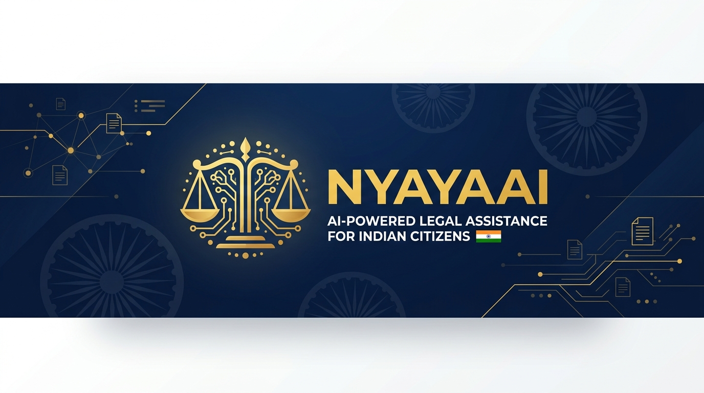
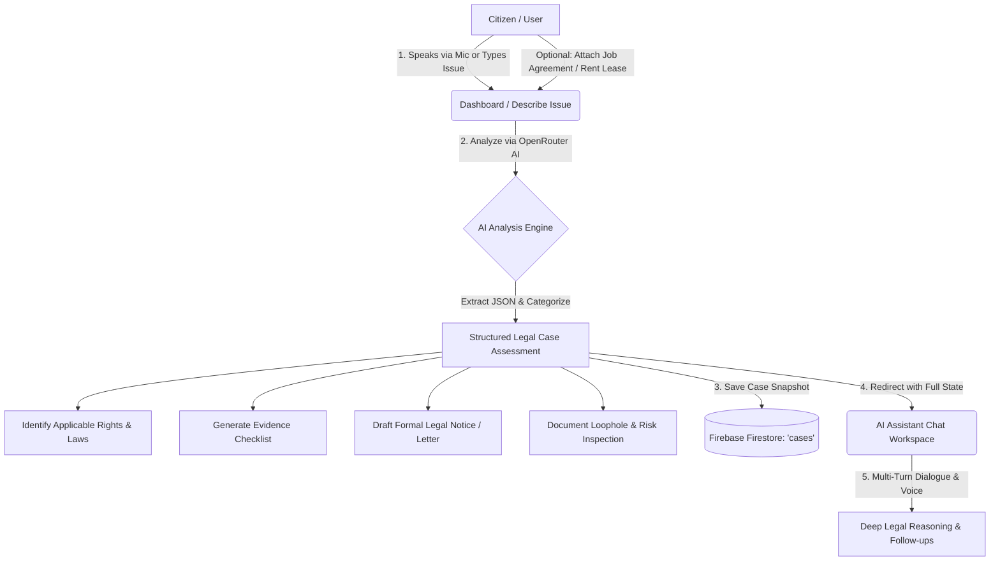
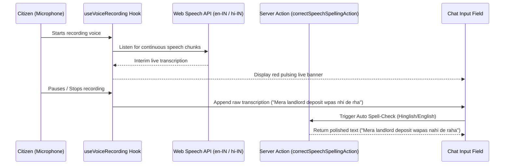
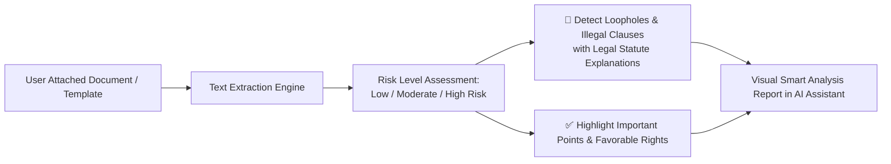

<div align="center">
  

  <br />

  # ⚖️ NyayaAI — AI-Powered Legal Operating System for India 🇮🇳

  **From Legal Confusion to Actionable Legal Remedy · Bilingual (English, Hindi & Hinglish)**

  [](https://nextjs.org/)
  [](https://react.dev/)
  [](https://tailwindcss.com/)
  [](https://firebase.google.com/)
  [](https://www.typescriptlang.org/)
  [](LICENSE)

  <br />

  [🌐 Live Demo](#) · [📖 System Flowcharts](#-system-architecture--flowcharts) · [🔥 Firebase Schema](#-firebase-firestore-schema-structure) · [🐛 Report Issue](https://github.com/yashharfode/Nyaya-AI/issues)

</div>

---

## 📋 Table of Contents

- [About NyayaAI](#-about-nyayaai)
- [System Architecture & Flowcharts](#-system-architecture--flowcharts)
  - [1. End-to-End Legal Assistance Workflow](#1-end-to-end-legal-assistance-workflow)
  - [2. Bilingual Voice Speech-to-Text & Auto Spell-Check Pipeline](#2-bilingual-voice-speech-to-text--auto-spell-check-pipeline)
  - [3. AI Document Risk & Loophole Inspection Flowchart](#3-ai-document-risk--loophole-inspection-flowchart)
- [🔥 Firebase Firestore Schema Structure](#-firebase-firestore-schema-structure)
  - [1. `users` Collection](#1-users-collection)
  - [2. `cases` Collection (Legal Analysis & Documents)](#2-cases-collection-legal-analysis--documents)
  - [3. `chats` Collection (AI Assistant Conversations)](#3-chats-collection-ai-assistant-conversations)
  - [4. `evidence` Collection (Digital Vault)](#4-evidence-collection-digital-vault)
  - [5. `academy_progress` Collection (Gamified Legal Quests)](#5-academy_progress-collection-gamified-legal-quests)
- [✨ Key Features & Milestones](#-key-features--milestones)
- [🛠️ Tech Stack](#-tech-stack)
- [🚀 Getting Started](#-getting-started)
- [🌍 Multi-Language & Hinglish Support](#-multi-language--hinglish-support)
- [📄 License](#-license)

---

## 🏛️ About NyayaAI

**NyayaAI** is not just an AI chatbot — it is a comprehensive **AI-Powered Legal Operating System** tailored specifically for Indian citizens, tenants, employees, and consumers. Navigating Indian legal frameworks (Bharatiya Nyaya Sanhita, Consumer Protection Act, IT Act, Hindu Marriage Act, etc.) can be daunting. NyayaAI bridges the justice gap by providing:

- 🤖 **Bilingual AI Legal Assistant (EN / Hinglish & Hindi)** — Real microphone speech-to-text with automatic Hinglish/English spelling correction and deep reasoning toggle.
- 📝 **Automated Notice & Complaint Generator** — Ready-to-file legal drafts, RTI applications, FIR formats, and consumer forum letters.
- 📄 **AI Document Evaluation** — Upload job offers, rental agreements, or contracts to uncover loopholes, illegal clauses, and important rights.
- 🎓 **Interactive Legal Academy** — Gamified quests and scenarios to help citizens master their fundamental rights.
- 📰 **Verified Legal News & Courts Directory** — Structured Supreme Court / High Court directories, e-Filing links, and real-time legal updates.

---

## 📊 System Architecture & Flowcharts

### 1. End-to-End Legal Assistance Workflow



---

### 2. Bilingual Voice Speech-to-Text & Auto Spell-Check Pipeline

NyayaAI supports native **Web Speech API (`SpeechRecognition`)** with real-time Indian English (`en-IN`), Devanagari Hindi (`hi-IN`), and Roman **Hinglish** transliteration.



---

### 3. AI Document Risk & Loophole Inspection Flowchart



---

## 🔥 Firebase Firestore Schema Structure

NyayaAI utilizes **Firebase Authentication** and **Google Cloud Firestore** as its primary cloud database for real-time synchronization across devices. Below is the complete schema definition for all Firestore collections:

### 1. `users` Collection
Stores authenticated citizen profile data, tier status, and UI preferences.

```typescript
// Collection Path: /users/{userId}
interface UserDocument {
  uid: string;                     // Primary Key (Firebase Auth UID)
  email: string;                   // Citizen email address
  displayName: string;             // Full name
  photoURL?: string;               // Optional profile avatar URL
  role: "CITIZEN" | "ADVOCATE";    // Role classification
  tier: "FREE" | "PRO";            // Subscription tier (PRO unlocks full Academy & Unlimited AI)
  preferredLanguage: "en" | "hi";  // Default UI and voice language
  createdAt: Timestamp;            // Account creation timestamp
  lastLoginAt: Timestamp;          // Most recent authentication timestamp
}
```

---

### 2. `cases` Collection (Legal Analysis & Documents)
Stores structured AI evaluations generated when a user describes an issue or analyzes a legal agreement.

```typescript
// Collection Path: /cases/{caseId}
interface CaseDocument {
  id?: string;                     // Auto-generated Firestore Document ID
  userId: string;                  // Foreign Key -> /users/{userId}
  originalIssue: string;           // Citizen's raw description of the legal problem
  attachedDocumentName?: string;   // Name of uploaded/selected template (e.g., "Rental Agreement Draft")
  attachedDocumentText?: string;   // Full text content of the analyzed document
  
  // Structured AI Assessment
  category: string;                // e.g., "Consumer Dispute", "Cyber Crime", "Property Dispute"
  severity: "Low" | "Medium" | "High";
  applicableRights: string[];      // Array of Indian statutes and constitutional rights
  evidenceChecklist: string[];     // Recommended evidence items to collect
  recommendedAuthority: string;    // e.g., "National Consumer Disputes Redressal Commission"
  complaintDraft: string;          // Formatted formal legal notice or complaint draft
  nextSteps: string[];             // Ordered action steps for the citizen
  resolutionTime: string;          // Estimated resolution timeline (e.g., "30 - 60 Days")
  summary: string;                 // 2-3 sentence legal executive summary
  implications: string[];          // Legal consequences and limitation periods
  
  // Document Evaluation Metadata (Optional)
  documentAnalysis?: {
    title: string;                 // Document title/type
    riskLevel: "Low Risk" | "Moderate Risk" | "High Risk";
    loopholes: string[];           // Detected illegal clauses or red flags
    importantPoints: string[];     // Important favorable clauses or citizen rights
  } | null;

  status: "Analyzed" | "In Progress" | "Resolved";
  createdAt: Timestamp;            // Server timestamp
}
```

---

### 3. `chats` Collection (AI Assistant Conversations)
Stores multi-turn conversational AI threads, including legal reasoning details and voice transcriptions.

```typescript
// Collection Path: /chats/{chatId}
interface ChatDocument {
  id?: string;                     // Auto-generated Firestore Document ID
  userId: string;                  // Foreign Key -> /users/{userId}
  caseId?: string;                 // Optional associated Case ID -> /cases/{caseId}
  title: string;                   // Chat thread title (auto-summarized from query)
  createdAt: Timestamp;            // Conversation start timestamp
  updatedAt: Timestamp;            // Last message timestamp
  
  messages: Array<{
    id: string;                    // Unique message UUID
    role: "user" | "assistant";    // Message author role
    content: string;               // Markdown-formatted message text
    reasoning?: string;            // Deep reasoning summary from AI model
    reasoningDetails?: string;     // Full step-by-step statutory reasoning log
    modelUsed: string;             // e.g., "inclusionai/ling-3.0-flash:free"
    timestamp: Timestamp;
  }>;
}
```

---

### 4. `evidence` Collection (Digital Vault)
Stores metadata for citizen digital evidence, receipts, audio recordings, and case documents.

```typescript
// Collection Path: /evidence/{evidenceId}
interface EvidenceDocument {
  id?: string;                     // Auto-generated Firestore Document ID
  userId: string;                  // Foreign Key -> /users/{userId}
  caseId?: string;                 // Optional Foreign Key -> /cases/{caseId}
  title: string;                   // Descriptive evidence title
  category: "DOCUMENT" | "RECEIPT" | "AUDIO" | "SCREENSHOT" | "OTHER";
  fileUrl: string;                 // Cloud storage URL
  fileSize: number;                // Byte size
  uploadedAt: Timestamp;
}
```

---

### 5. `academy_progress` Collection (Gamified Legal Quests)
Tracks user mastery of Indian constitutional rights and completed interactive academy quests.

```typescript
// Collection Path: /users/{userId}/academy_progress/{questId}
interface AcademyProgressDocument {
  questId: string;                 // e.g., "quest-tenant-rights", "quest-consumer-protection"
  userId: string;                  // Foreign Key -> /users/{userId}
  status: "LOCKED" | "IN_PROGRESS" | "COMPLETED";
  score: number;                   // Quiz or scenario score (0 - 100)
  xpEarned: number;                // Experience points awarded
  completedAt?: Timestamp;
}
```

---

## ✨ Key Features & Milestones

| Module | Feature | Status | Description |
| :--- | :--- | :---: | :--- |
| **Microphone Voice** | **Bilingual Speech-to-Text** | ✅ Live | Real Web Speech API recording in English, Hinglish (`en-IN`), & Hindi (`hi-IN`). |
| **Voice Auto-Correct** | **Hinglish & English Spell-Check** | ✅ Live | Dedicated AI action (`correctSpeechSpellingAction`) polishes spoken typos automatically. |
| **Document Evaluation** | **AI Loopholes & Risk Inspection** | ✅ Live | Upload agreements to detect high-risk clauses, illegal terms, and citizen rights. |
| **Legal News & Courts** | **Professional Directory & News** | ✅ Live | Structured High Court/Supreme Court directories, e-Filing portals, and news feeds. |
| **Dashboard Navigation** | **Minimize / Collapse Sidebar** | ✅ Live | Compact 76px icon-only mode with `localStorage` persistence and **`⌘B`** shortcut. |
| **Legal Academy** | **Interactive Quests & Scenarios** | ✅ Live | Master tenant laws, RTI filing, consumer rights, and cyber crime through gamified quests. |
| **AI Reasoning** | **Deep Statutory Reasoning Toggle** | ✅ Live | Inspect step-by-step statutory citations and legal logic behind every AI answer. |

---

## 🛠️ Tech Stack

<div align="center">

| Layer | Technology |
| :--- | :--- |
| **Framework** | [Next.js 16.2](https://nextjs.org/) (App Router + Turbopack) |
| **Language** | [TypeScript 5](https://www.typescriptlang.org/) |
| **UI Library** | [React 19](https://react.dev/) |
| **Styling** | [Tailwind CSS 4](https://tailwindcss.com/) + Custom Design System |
| **Cloud Database** | [Firebase Firestore](https://firebase.google.com/docs/firestore) |
| **Authentication** | [Firebase Auth](https://firebase.google.com/docs/auth) + JWT Middleware Guards |
| **AI Engine** | [OpenRouter API](https://openrouter.ai/) (Ling 3.0 Flash & Gemini 2.5 Flash) |
| **Speech-to-Text** | Native Web Speech API (`SpeechRecognition` / `webkitSpeechRecognition`) |
| **i18n** | `next-intl` (English, Hindi, and 13+ Regional Languages) |

</div>

---

## 🚀 Getting Started

### Prerequisites
- **Node.js** >= 18.x
- **npm** >= 9.x
- A valid **OpenRouter API Key** (`OPENROUTER_API_KEY`)

### Installation

1. **Clone the repository**
   ```bash
   git clone https://github.com/yashharfode/Nyaya-AI.git
   cd Nyaya-AI
   ```

2. **Install dependencies**
   ```bash
   npm install
   ```

3. **Configure environment variables**
   Create a `.env` file in the root directory:
   ```env
   # AI API Key (OpenRouter)
   OPENROUTER_API_KEY=sk-or-v1-your-api-key-here

   # Firebase Client Config
   NEXT_PUBLIC_FIREBASE_API_KEY=your_api_key
   NEXT_PUBLIC_FIREBASE_AUTH_DOMAIN=your_project.firebaseapp.com
   NEXT_PUBLIC_FIREBASE_PROJECT_ID=your_project_id
   NEXT_PUBLIC_FIREBASE_STORAGE_BUCKET=your_project.appspot.com
   NEXT_PUBLIC_FIREBASE_MESSAGING_SENDER_ID=your_sender_id
   NEXT_PUBLIC_FIREBASE_APP_ID=your_app_id
   ```

4. **Start the development server**
   ```bash
   npm run dev
   ```

5. **Open in your browser**
   ```
   http://localhost:3000
   ```

---

## 🌍 Multi-Language & Hinglish Support

NyayaAI is engineered from the ground up for linguistic diversity in India:
- **English (`en`)**: Official legal terminology and formal court draft formats.
- **Hindi (`hi`)**: Devanagari script for accessible citizen guidance.
- **Hinglish (Roman Script Hindi)**: Spoken naturally via microphone (*"Mera security deposit return nahi hua"*), automatically spell-checked and polished by AI.

---

## 📄 License

Distributed under the **MIT License**. See `LICENSE` for more information.

---

<div align="center">

  **Made with ❤️ for India 🇮🇳**

  *Empowering every citizen with legal knowledge, clarity, and actionable rights.*

</div>
